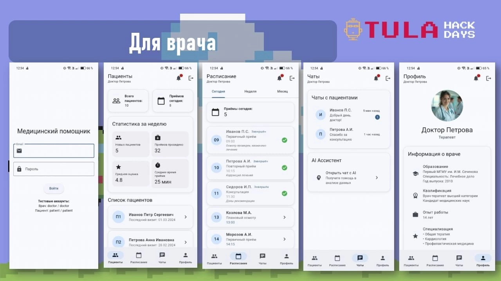
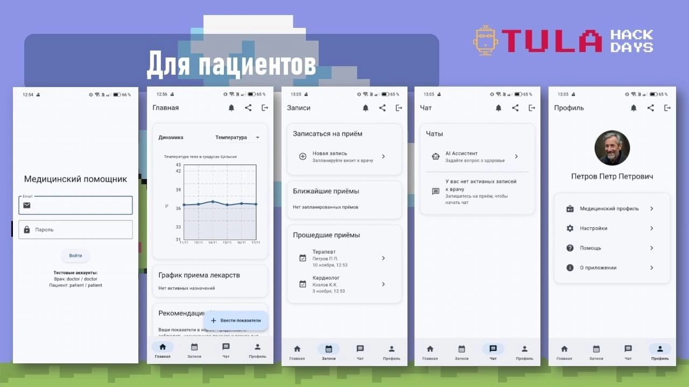

# 🏥 HappyHUB
<p align="center">
  
</p>

<p align="center">
  <a href="#-основной-функционал">Особенности</a> •
  <a href="#-технический-стек">Технологии</a> •
  <a href="#-установка-и-настройка">Установка</a> •
  <a href="#-структура-проекта">Разработка</a> •
  <a href="#-лицензия">Лицензия</a>
</p>


## 📱 О проекте

<p align="center">
  
</p><p align="center">
  
</p>
HappyHUB - это инновационное мобильное приложение для взаимодействия врачей и пациентов, разработанное на Flutter. Приложение предоставляет комплексное решение для управления медицинскими записями, коммуникации между врачами и пациентами, а также мониторинга здоровья.

## Скачать готовые сборки для Windows и Android: https://disk.yandex.ru/d/UirhKK44qwuLwg
Результат конкурса: https://tulahackdays.ru/2024/

## ✨ Основной функционал

### Для пациентов:
1. **Мониторинг здоровья**
   - Отслеживание основных показателей:
     - Пульс (уд/мин)
     - Давление (мм рт.ст.)
     - Температура (°C)
     - Уровень сахара (ммоль/л)
     - Сатурация (%)
     - Холестерин (ммоль/л)
   - Визуализация данных в виде графиков
   - Анализ динамики показателей

2. **Управление медикаментами**
   - График приема лекарств
   - Уведомления о времени приема
   - Детальные инструкции по применению
   - Отслеживание начала и окончания курса лечения

3. **Запись к врачу**
   - Онлайн-запись на прием
   - История посещений
   - Информация о назначениях
   - Доступ к медицинским заключениям

4. **Коммуникация**
   - Чат с лечащим врачом
   - AI-ассистент для консультаций
   - Отправка фото и документов
   - Система уведомлений

### Для врачей:
1. **Управление пациентами**
   - Список пациентов
   - Детальные профили пациентов с историей приёмов
   - Медицинские карты
   - Назначение лекарств и процедур
   - Мониторинг состояния пациентов

2. **Профессиональный профиль**
   - Образование и квалификация
   - Специализация
   - Опыт работы
   - Действующие сертификаты

3. **Система поддержки**
   - FAQ с частыми вопросами
   - Техническая поддержка
   - Обучающие материалы
   - Контакты для связи

## 🛠 Технический стек

### Основные технологии:
- Flutter & Dart
- Provider (управление состоянием)
- Shared Preferences (локальное хранение)
- FL Chart (визуализация данных)
- HTTP (работа с API)
- Intl (локализация)

### Дополнительные возможности:
- Image Picker (работа с изображениями)
- Permission Handler (управление разрешениями)
- Share Plus (функционал шеринга)
- Connectivity Plus (проверка подключения)

## 🌐 Поддержка платформ:
- iOS
- Android
- Web
- Desktop (Windows)

## 🔒 Безопасность:
- Авторизация пользователей
- Защита персональных данных
- Шифрование сообщений
- Управление разрешениями

## 🌍 Локализация:
- Русский язык
- Английский язык (в разработке)

## 💡 Особенности интерфейса:
- Material Design
- Темная и светлая темы
- Адаптивный дизайн
- Анимации и переходы

## 🔄 Версионность:
Текущая версия: 0.1.0

## 📱 Системные требования

### iOS
- iOS 11.0+
- Минимум 100MB свободного места
- Камера и доступ к галерее
- Подключение к интернету

### Android
- Android 5.0+
- Минимум 100MB свободного места
- Камера и доступ к галерее
- Подключение к интернету

### Разрешения приложения:
- Камера (для отправки фото в чат)
- Галерея (для отправки изображений)
- Микрофон (для записи видео)

## 🔧 Установка и настройка

### Требования к системе
- Flutter SDK 3.5.4 или выше
- Dart SDK 3.0.0 или выше

### Шаги установки

1. Клонируйте репозиторий:
   ```bash
   git clone https://github.com/ShemshurDav/tula_hack_days
   ```

2. Перейдите в директорию проекта:
   ```bash
   cd tula_hack_days
   ```

3. Установите зависимости:
   ```bash
   flutter pub get
   ```

4. Запустите приложение:
   ```bash
   flutter run
   ```

## 📁 Структура проекта

```
lib/
├── models/         # Модели данных
├── providers/      # Провайдеры состояния
├── screens/        # Экраны приложения
│   ├── doctor/     # Интерфейс врача
│   └── patient/    # Интерфейс пациента
├── services/       # Сервисы
├── utils/          # Утилиты
└── widgets/        # Переиспользуемые виджеты
```

## 🤝 Вклад в проект

1. Форкните репозиторий
2. Создайте ветку для фичи (`git checkout -b feature/amazing-feature`)
3. Зафиксируйте изменения (`git commit -m 'Add amazing feature'`)
4. Отправьте изменения в ветку (`git push origin feature/amazing-feature`)
5. Откройте Pull Request

## 📞 Контакты и поддержка

- Email: support@happyhub.ru
- Телефон поддержки: 8-800-XXX-XX-XX
- Telegram: @happyhub_support
- Website: https://happyhub.ru

## 📄 Лицензия

Copyright © 2024 HappyHub. Все права защищены.

## 🎯 Дорожная карта

- [ ] Интеграция с медицинскими устройствами
- [ ] Видеоконсультации
- [ ] Электронные рецепты
- [ ] Интеграция с лабораториями
- [ ] Расширенная аналитика
- [ ] Мобильные уведомления
